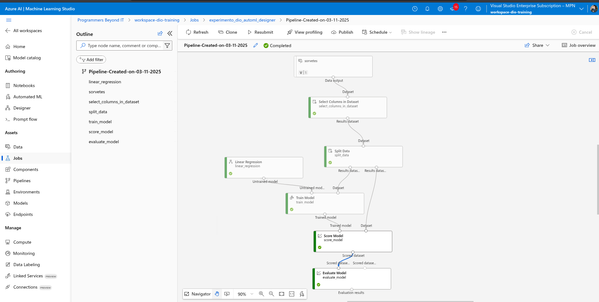
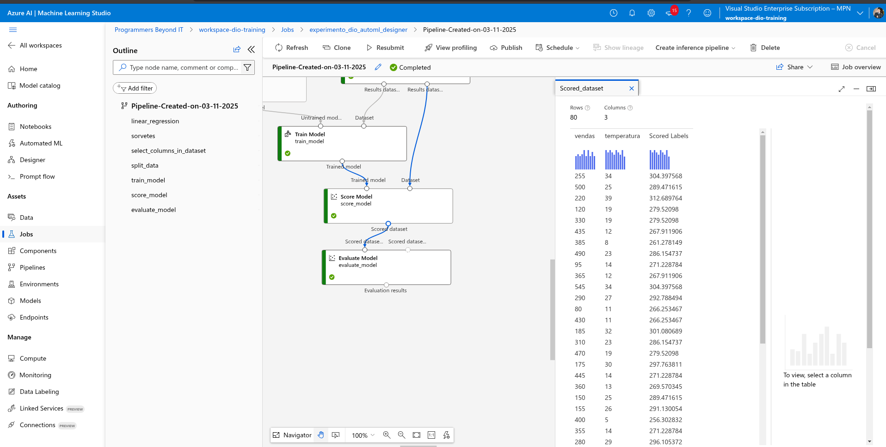
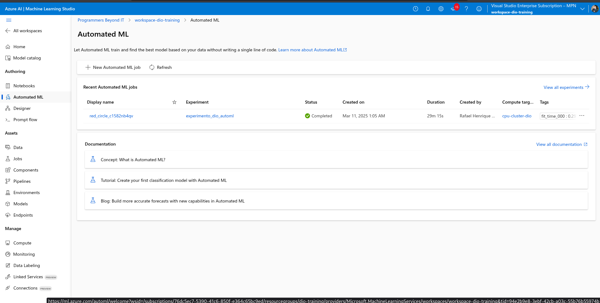
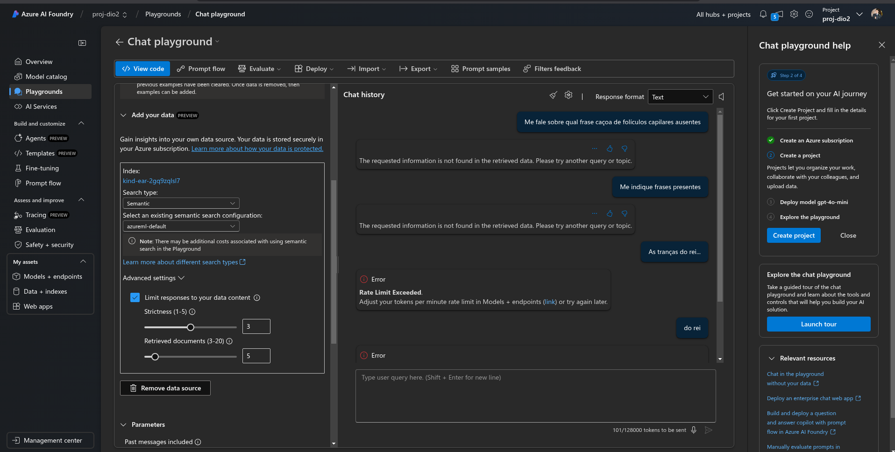
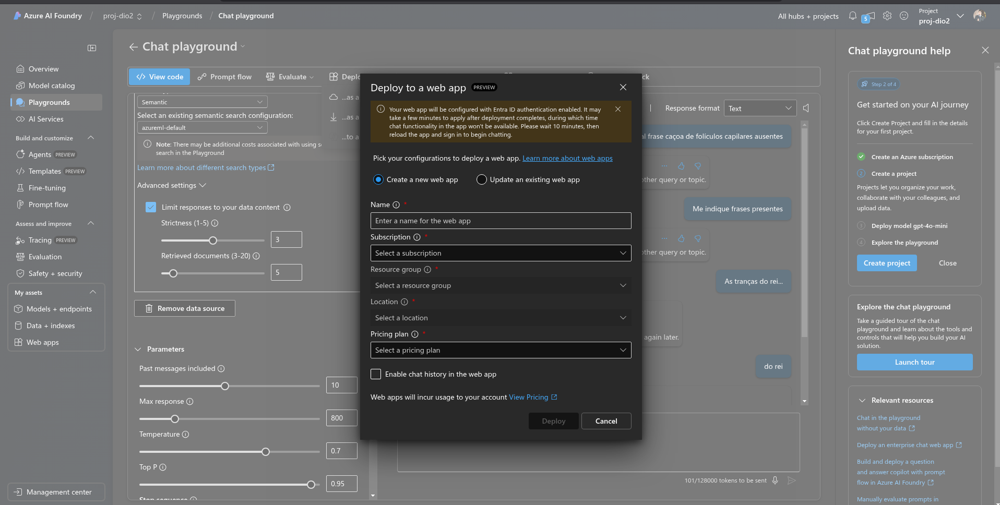

# Projeto 1:  de Previsão de Vendas de Sorvete com Machine Learning 🍦📊

Este projeto tem como objetivo desenvolver um modelo de Machine Learning para prever as vendas de sorvete com base na temperatura do dia. O modelo será treinado, gerenciado e implantado utilizando o Azure Machine Learning (AML) e outras ferramentas da plataforma Azure.

## Visão Geral do Projeto

### Cenário
Imagine que você é proprietário de uma sorveteria chamada Gelato Mágico, localizada em uma cidade litorânea. A quantidade de sorvetes vendidos diariamente tem uma forte correlação com a temperatura ambiente. Para otimizar a produção e reduzir desperdícios, você decide usar Machine Learning para prever a demanda com base na temperatura.

### Objetivos
- Treinar um modelo de regressão para prever vendas de sorvete.
- Registrar e gerenciar o modelo usando o MLflow.
- Implementar o modelo para previsões em tempo real no Azure.
- Criar um pipeline estruturado para treinamento e teste do modelo.

## Implementação no Azure

### Configuração do Ambiente
1. **Azure Machine Learning (AML)**: Crie um workspace no AML para centralizar todos os recursos do projeto.
2. **Experimentos**: Utilize o AML para criar experimentos e treinar modelos de regressão com bibliotecas como Scikit-learn.
3. **MLflow**: Integre o MLflow para rastrear métricas, parâmetros e artefatos do modelo.

### Treinamento e Implantação do Modelo
- **Treinamento**: Treine o modelo utilizando dados históricos de vendas e temperatura.
- **Implantação**: Crie endpoints de inferência no AML para previsões em tempo real, utilizando Azure Kubernetes Service (AKS) ou Azure Container Instances (ACI).

### Pipeline e Monitoramento
- **Pipeline de Machine Learning**: Automatize o fluxo de trabalho desde o pré-processamento até a implantação.
- **Monitoramento**: Utilize ferramentas do AML para monitorar o desempenho do modelo em produção, como detecção de desvio de dados.

## Imagens do Projeto

### Pipeline de Machine Learning


### Resultados do Modelo


### Jobs de Automated ML


## Conclusão
Este projeto demonstra como utilizar o Azure Machine Learning para criar um modelo preditivo que ajuda a otimizar a produção de sorvete com base na temperatura. A implementação no Azure garante escalabilidade, reprodutibilidade e monitoramento contínuo do modelo.

Para mais detalhes, visite o [repositório do projeto no GitHub](https://github.com/rquaresma42/dio_project_rhq).

# ==========================================================================================

# Projeto 2: Criando um Chatbot Baseado em Conteúdo de PDFs com Azure AI Foundry 📚🤖

Este projeto tem como objetivo desenvolver um chatbot interativo que responde perguntas com base no conteúdo de arquivos PDF, utilizando o **Azure AI Foundry**. A plataforma Azure AI Foundry oferece ferramentas avançadas para processamento de linguagem natural (NLP), embeddings, e buscas vetorizadas, permitindo a criação de um sistema robusto e escalável.

## Visão Geral do Projeto

### Cenário
Imagine que você é um estudante de Engenharia de Software prestes a escrever seu Trabalho de Conclusão de Curso (TCC). Para facilitar a revisão e correlação de diversos artigos científicos, você decide criar um sistema de busca inteligente que interpreta os PDFs, organiza informações e gera respostas relevantes com base no conteúdo carregado.

### Objetivos
- Carregar arquivos PDF contendo informações relevantes para estudo ou projeto.
- Implementar um sistema de busca vetorial para indexar e recuperar informações dos PDFs.
- Utilizar inteligência artificial para gerar respostas baseadas no conteúdo dos documentos.
- Desenvolver um chat interativo para realizar perguntas e obter respostas contextuais.

## Implementação com Azure AI Foundry

### Passos para Desenvolver o Chatbot
1. **Carregamento de PDFs**: Utilize o **Azure Blob Storage** para armazenar os arquivos PDF e o **Azure Form Recognizer** para extrair texto dos documentos.
2. **Processamento de Texto**: Utilize o **Azure Text Analytics** para realizar a limpeza e tokenização do texto extraído.
3. **Embeddings e Busca Vetorial**: Utilize o **Azure Cognitive Search** com modelos de embeddings para converter o texto em vetores e implementar uma busca vetorial para encontrar trechos relevantes.
4. **IA Generativa**: Utilize o **Azure OpenAI Service** (com modelos como GPT-3 ou GPT-4) para gerar respostas contextuais com base nos trechos encontrados.
5. **Interface de Chat**: Desenvolva uma interface interativa utilizando **Azure Bot Service** ou **Azure Web Apps** para permitir que os usuários façam perguntas e recebam respostas.

### Exemplo de Fluxo de Trabalho no Azure AI Foundry
1. **Armazenamento de PDFs**: Carregue os PDFs no Azure Blob Storage.
2. **Extração de Texto**: Use o Azure Form Recognizer para extrair o texto dos PDFs.
3. **Indexação e Busca**: Utilize o Azure Cognitive Search para indexar o texto e realizar buscas vetorizadas.
4. **Geração de Respostas**: Integre o Azure OpenAI Service para gerar respostas contextuais.
5. **Interface de Chat**: Crie um bot interativo com o Azure Bot Service e implante-o em um Azure Web App.

###Como foi feito via interface gráfica, temos as imagens a seguir:


### Criação do chat


### Deploy de WebApp



### Exemplo de Código para Integração com Azure AI Foundry
```python
from azure.storage.blob import BlobServiceClient
from azure.ai.formrecognizer import DocumentAnalysisClient
from azure.core.credentials import AzureKeyCredential

# Configurações do Azure
blob_connection_string = "sua_string_de_conexao"
form_recognizer_endpoint = "seu_endpoint"
form_recognizer_key = "sua_chave"

# Carregar PDF do Azure Blob Storage
def load_pdf_from_blob(container_name, blob_name):
    blob_service_client = BlobServiceClient.from_connection_string(blob_connection_string)
    blob_client = blob_service_client.get_blob_client(container=container_name, blob=blob_name)
    blob_data = blob_client.download_blob()
    return blob_data.readall()

# Extrair texto com Azure Form Recognizer
def extract_text_from_pdf(pdf_content):
    document_analysis_client = DocumentAnalysisClient(
        endpoint=form_recognizer_endpoint, credential=AzureKeyCredential(form_recognizer_key)
    )
    poller = document_analysis_client.begin_analyze_document("prebuilt-document", pdf_content)
    result = poller.result()
    return result.content

# Exemplo de uso
pdf_content = load_pdf_from_blob("meu-container", "artigo.pdf")
text = extract_text_from_pdf(pdf_content)
print(text)